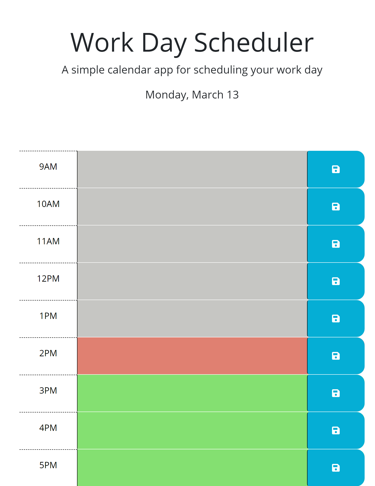

# 05 Third-Party APIs: Work Day Scheduler

## Description
This simple calendar application allows a user to save events for each hour of the day by modifying starter code. This app will run in the browser and feature dynamically updated HTML and CSS powered by jQuery. This app uses day.js library for adding real time. When the user refreshes the browser, the events entered will still be there. 

## Installation
- copy github https/ssh link
- git clone to terminal with github https/ssh link

## Usage

https://cjsolis12.github.io/Work-Day-Schedular/

## Credits
- https://day.js.org/
- https://www.youtube.com/watch?v=wiLEvI28Gso
- https://api.jquery.com/jquery.data/
- https://stackoverflow.com/
- https://www.w3schools.com/jquery/jquery_syntax.asp

